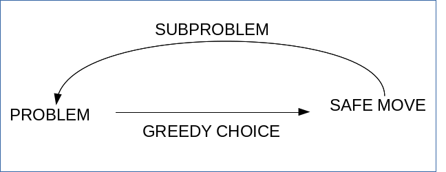

## Week 2

### Questions

1. Prove the logarithmic relations : 	
   - $$log_{a}n^{k}=k.log_{a}n$$
   
   - $$log_{a}(nm)=log_{a}n+log_{b}m$$
   
   - $$n^{log_{a}b}=b^{log_{a}n}$$
   
   - $$log_{a}n.log_{b}a=log_{b}n$$

2. What is the Piscano series?

3. How to quickly calculate the GCD and LCM of two integers?

### Notes

- Definition of Big-O : $$f(n)=O(g(n))$$ only if there exists some N and c < 0 such that $$f(n) \leq c.g(n)$$ for all $$n \geq N$$.

- Code snippet for Fibonacci


//easy way to do fibonacci
int fibonacci(int n) {
    int prev = 0, cur = 1;
    for (int i = 2; i <= n; ++i){
        prev ^= cur ^= prev ^= cur;
        cur = cur + prev;
    }
    return cur;
}


- The sum of fist n Fibonacci terms, $$S(n) = Fib(n+2) - 1$$.

- Fibonacci series mod m $$F_{mod(m)}$$, follows a periodic pattern called the Pisano series for $$m \geq 2 $$. It always starts with 0,1. So finding where 0,1 occurs together in $$F_{mod(m)}$$ will allow you to find the periodicity of this series and hence easily calculate any value in the series without doing the entire computation.


  int fib_mod_m(int n, int m){
    // find the periodicity of Pisano series of mod m.
    int count = periodicity_pisano(m);
    // calculate n mod count
    int n_mod = n % count;
    
    return fibonacci(n_mod) % m;
  }


- GCD can be quickly calculated using the Eucildean algorithm.

- LCM can be quickly calculated using GCD, $$lcm(a,b)=\frac{a.b}{gcd(a,b)}$$.

  ## Week 3 : Greedy Algorithms

  ### Questions

1. What is a subproblem?

2. Safe move for car refueling problem.

3. Safe move for grouping children problem.

4. Safe move for fractional knapsack problem.

  ### Notes

- A subproblem is a similar problem of a smaller size.

- A **safe move** is a greedy choice which is a part of the final optimal solution.

- Greedy strategy :

- Find a safe move.

- Prove it's correctness.

- Choose a subproblem.

- Apply safe move to subproblem.

  

- Car refueling problem safe move : allow the car to travel to the farthest refill point it can with the fuel it has.

- Grouping children problem safe move : allow the leftmost value of a subproblem to be the starting point of the new group.

- Fractional knapsack problem safe move : choose items based on a descending order of value per weight.

  ## Week 4 : Divide and Conquer

  ### Questions

1. What are the different essential parts that make up a problem solvable using divide and conquer algorithms?

2. What is a recurrence relation?

3. What are the steps involved in defining a divide and conquer solution?

  ### Notes

- Divide and conquer strategy can be used if the problem : 

    - Can be divided into smaller, non-overlapping subproblems of the same type as the original problem.

    - Can be finally solved by combining the answers to all the subproblems.

- A divide a conquer strategy involves :

    - Defining a recursive solution

    - Formulating a recurrence relation and analyze runtime.

    - Optionally, create an iterative version of the algorithm.

- Recurrence relation : equation that recursively defines a sequence of values.
  
